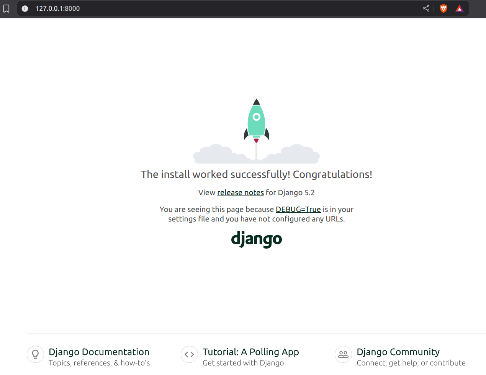
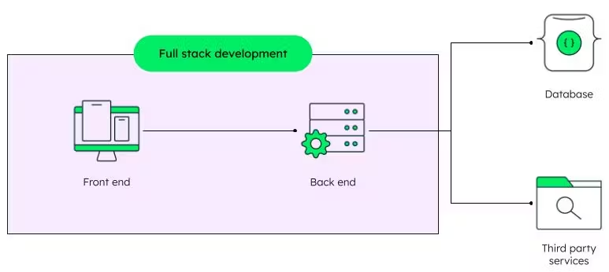
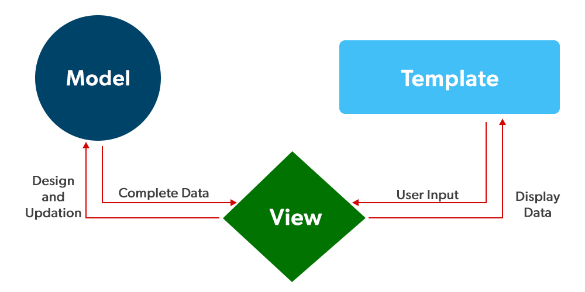
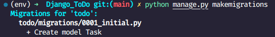
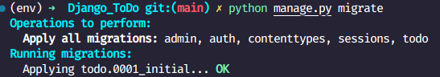

# Hello World of Web Development

I made a article series on `REACT JS`. Which went (life is pain but no traction gained :/ ) nowhere. But I guess I'm back.

Becuase what is Frontend without a Backend. So This article series is on `Django` and this is the first project of the series.

It's a siple To-Do application built solely using `Django` and some `Bootstrap` for styling and I called it `Hello World of Web Development` because this is the first project of the series and everyone starts with a To-Do application.

- [LinkedIn](https://www.linkedin.com/in/pro-programmer/)
- [YouTube](http://www.youtube.com/@itvaya)
- [gtihub](https://github.com/RishatTalukder/learning_react)
- [Gmail](talukderrishat2@gmail.com)
- [discord](https://discord.gg/ZB495XggcF)

#### Pre-requisites

- Python installed in your system
- Basic knowledge of Python
- Basic knowledge of HTML and CSS
- Basic knowledge of Django (not mandatory but helpful)
- Basic knowledge of Command Line (Terminal)
- Basic knowledge of Databases and Table relationships (not mandatory but helpful)

# Setting up a django project

First we need to create a `virtual environment` to keep our project dependencies isolated from other projects. To do that, open your terminal and first check your version of python by running the command:

```bash
python --version # for windows
```
or

```bash
python3 --version # for mac and linux
```

I'm using python 3.11.8 so you should have at least python 3.8 or higher. 

Why we need a virtual environment? 

Because when we are using multiple packages in our project, we don't want to mess up with the global packages that are installed in our system. So we create a virtual environment for each project. So, that it is isolated and free from any conflicts.

Now, navigate to your desktop or any other folder of your choice where you want to create your project using the `cd` command. For example, if you want to create your project in the desktop, run the command:

```bash
cd Desktop
```

I always like to keep all my projects in my `desktop` So that it's easy to find them.

So, to create a virtual environment, run the command:

```bash 
python -m venv env # for windows
```
or

```bash
python3 -m venv env # for mac and linux
```

> A environment is like a fresh/portable python installation. it works exactly like a normal python installation but it is isolated from the global python installation.

This will create a folder named `env` in your project directory. I'll assume you also navigated to your desktop before running the command. So, you should see a folder named `env` in your desktop.

Now, that we need to do to use this fresh python installation is to activate it. To do that, run the command:

```bash
.\env\Scripts\activate # for windows
```
or

```bash
source env/bin/activate # for mac and linux
```

If you see `(env)` in your terminal, that means your virtual environment is activated. Now, you can install any package in this environment without affecting the global packages.

And we are ready to start our django project.

Let's install `Django` in our virtual environment. To do that, run the command:

```bash
pip install django
```
> ALways remember to check if the virtual environment is activated before installing any package. If not, you might end up installing the package globally which is not what we want.

After running check for the version of django by running the command:

```bash
django-admin --version
```

You should see the version of django installed in your virtual environment. As of now, the latest version is `5.2.6`.

And we are ready to start.

Our setup is complete.

# Creating a Django Project

To create a django project, navigate to your project directory (if you are not already there, for me it's the desktop) and run the command:

```bash
django-admin startproject TodoApp
```

This will create a folder named `TodoApp` in your project directory. This is the root project folder.

In side the `TodoApp` folder, you will see another folder named `TodoApp` and a file named `manage.py`. The inner `TodoApp` folder is the actual project folder where all the settings and configurations are stored. The outer `TodoApp` folder is just a container for the project.

This can cause some issues sometimes. So, to avoid that and make a cleaner structure, I like to make a root project folder before hand and then create the django project inside that folder. So, let's do the cleaner way.

First make a new folder in your desktop named `DjangoToDoApp` and then copy the whole `env` folder inside the `DjangoToDoApp` folder. So, now your project structure should look like this:

```
Desktop(your project directory)
│
└───DjangoToDoApp(root project folder)
    │
    └───env(virtual environment)
```

Now navigate to the `DjangoToDoApp` folder using the command:

```bash
cd DjangoToDoApp
```

Now run the previous command to create the django project:

```bash
django-admin startproject BACKEND . # the dot at the end is important
```

> It's the same command as before but the dot at the end is important. It tells django to create the project in the current directory instead of creating a new folder.

So, Now you should see the `Backend` folder and the `manage.py` file inside the `DjangoToDoApp` folder. So, now your project structure should look like this:

```
Desktop(your project directory)
│
└───DjangoToDoApp(root project folder)
    │
    ├───env(virtual environment)
    │
    ├───BACKEND(django project folder)
    │   │
    │   ├───__init__.py
    │   ├───asgi.py
    │   ├───settings.py
    │   ├───urls.py
    │   └───wsgi.py
    │
    └───manage.py
```

Now, don't get confused with the names. Just think of `DjangoToDoApp` as the root project folder, `env` as the virtual environment, `Backend` as the django project folder and `manage.py` as the `main` file of the project.

Now, let's just Learn a bit about the files and folders that are created by default in a django project.

- `manage.py`: This is the main file of the project. It is used to run various commands like starting the development server, creating migrations, etc.
- `__init__.py`: This is an empty file that tells python that this folder is a package. We won't be needing to modify this file 99.9999% of the time.
- `asgi.py`: This is the entry point for ASGI-compatible web servers to serve your project. ASGI is the successor to WSGI and is used for handling asynchronous web applications. We won't be needing to modify this file 99.9999% of the time.
- `settings.py`: This is the main configuration file of the project. It contains all the settings and configurations of the project. We will be modifying this file `A LOT!`
- `urls.py`: This file contains all the URL patterns of the project. We will be modifying this file `A LOT!`. Maybe we will get more confused with this file than the `settings.py` file.
- `wsgi.py`: This is the entry point for WSGI-compatible web servers to serve your project. WSGI is the standard for Python web applications and is used for handling synchronous web applications. We won't be needing to modify this file 99.9999% of the time.

Now, that we have a basic understanding of the files and folders, let's run the development server to see if everything is working fine.

To do that, run the command:

```bash
python manage.py runserver # for windows, mac and linux
```

if this not working for linux or mac, try:

```bash
python3 manage.py runserver # for mac and linux
```

after running the command, you should see something like this:

```bash
Watching for file changes with StatReloader
Performing system checks...

System check identified no issues (0 silenced).

You have 18 unapplied migration(s). Your project may not work properly until you apply the migrations for app(s): admin, auth, contenttypes, sessions.
Run 'python manage.py migrate' to apply them.
September 14, 2025 - 06:55:27
Django version 5.2.6, using settings 'BACKEND.settings'
Starting development server at http://127.0.0.1:8000/
Quit the server with CONTROL-C.

WARNING: This is a development server. Do not use it in a production setting. Use a production WSGI or ASGI server instead.
For more information on production servers see: https://docs.djangoproject.com/en/5.2/howto/deployment/
```
If you see this, that means everything is working fine. Now, open your browser and go to the development server address given in the terminal. In my case, it's `http://127.0.0.1:8000/`. You should see the default django welcome page.



If you see this, that means everything is working fine. And we are ready to make a To-Do application using django.

## Understanding the structure of a fullstack web application

Now, django has a lot of built-in features and those can get really overwhelming really fast for a beginner. 

So, let's learn the structure of every fullstack web application first.

A fullstack web application has two main parts:
1. Frontend
2. Backend

The frontend is the part that the user interacts with. It is responsible for displaying the data to the user and taking input from the user. The frontend is built using HTML, CSS and JavaScript.

The backend is the part that handles the logic and data of the application. It is responsible for processing the data and sending it to the frontend. The backend is built using a server-side programming language like Python, Ruby, PHP, etc. In our case, we are using `Django` which is a web framework built using `Python`.

Backend has two main parts:
1. Server
2. Database

The server is responsible for handling the requests from the frontend and sending the appropriate response back to the frontend. In this case `Django is the server`.

So, django should be able to handle the requests from the frontend and send the appropriate response back to the frontend. To send the appropriate response back to the frontend, django needs to know what data to send. This data is stored in a database.

So, there must be a way to connect the `database` with the `server`. This is done using an `ORM` (Object Relational Mapping) built in django. The `ORM` is responsible for converting the data from the database into a format that can be understood by the server and vice versa.



Django has it's own built-in `ORM` which is really powerful and easy to use and also it supports multiple databases like `SQLite`, `PostgreSQL`, `MySQL`, etc. Also it has it's own built-in `admin panel` which gives you a GUI to interact with the database. So, you don't need to write any SQL queries to interact with the database. You can just use the `ORM` to interact with the database.

So, for now let's stick to the default database which is `SQLite`. It is a lightweight database and it is perfect for small projects like this.

If you have the development server running, you should see some errors in the terminal. This is because we have some unapplied migrations. Migrations are like version control for your database schema. They are used to keep track of the changes made to the database schema over time.

But we don't have a database yet. So, let's create the database by applying the migrations. To do that, stop the development server by pressing `CTRL + C` in the terminal and then run the command:

```bash
python manage.py migrate 
```

After that run the development server again by running the command:

```bash
python manage.py runserver
```

The errors should be gone now. If you see the default django welcome page again, that means everything is working fine.

And If you take a look in your project directory, you should see a new file named `db.sqlite3`. This is the database file. This file contains all the data of your application.

> if you are using vs code, you can see the database file in the file explorer. But not whats inside the file. I use a extension named `SQLite` to view the database file. 

And we have a working django project with a database setup. Now, we are ready to make a To-Do application using django.

# Creating a Django App

First we need to create a `Django App`. It's a Application template that contains all the files and folders needed to build a `specific feature` of the project.

A project can have multiple apps. For example, a blog project can have a `blog` app, a `comments` app, a `users` app, etc. Each app is responsible for a specific feature of the project.

We can make multiple apps in a django project to keep the code organized and modular. But for this project, we will only make one app named `todo`.

To create a django app, make sure you are in the project directory (for me it's `DjangoToDoApp`) and run the command:

```bash
python manage.py startapp todo
```

> By running this command, a new folder named `todo` will be created in your project directory. This is the app folder.

So, now your project structure should look like this:

```
Desktop(your project directory)
│
└───DjangoToDoApp(root project folder)
    │
    ├───env(virtual environment)
    │
    ├───BACKEND(django project folder)
    │   │
    │   ├───__init__.py
    │   ├───asgi.py
    │   ├───settings.py
    │   ├───urls.py
    │   └───wsgi.py
    │
    ├───manage.py
    │
    └───todo(django app folder)
        │
        ├───__init__.py
        ├───admin.py
        ├───apps.py
        ├───models.py
        ├───tests.py
        ├───views.py
        └───migrations
            └───__init__.py

```

In this folder, you will see some files and folders that are created by default. Let's learn about them:

- `__init__.py`: This is an empty file that tells python that this folder is a package. We won't be needing to modify this like never.
- `admin.py`: This file is used to register the models in the admin panel. We will be modifying this file later.
- `apps.py`: This file is used to configure the app. We won't be needing to modify this file like never.
- `models.py`: This file is used to define the models of the app. We will be modifying this file a lot.
- `tests.py`: This file is used to write tests for the app. We won't be needing to modify this file for now.
- `views.py`: This file is used to define the views of the app. We will be modifying this file a lot.
- `migrations`: This folder is used to store the migration files. We won't be modifying this folder at all.

Django uses the `MVC` (Model-View-Controller) architecture to build web applications. But in django, the `Controller` part is handled by the framework itself. So, we only need to worry about the `Model` and the `View` part.

## Model View Template (MVT) Architecture

This is a modern architecture used by a lot of web frameworks like `Django`, `Flask`, `Ruby on Rails`, etc. It is a variation of the `MVC` architecture.



Model refers to the `data` of the application. It is responsible for managing the data and the logic of the application. In django, the models are defined in the `models.py` file.

This is where we define the structure of the data and the relationships between the data. Which is handled by the `ORM` of django. ORMs are `Object Relational Mappers`. They are used to convert the data from the database into a format that can be understood by the server and vice versa and it is fully object oriented. So, we can interact with the database using python objects instead of writing raw SQL queries.

This model will send the data to the view when requested. View refers to the `user interface` of the application. It is responsible for displaying the data to the user and taking input from the user. In django, the views are defined in the `views.py` file. It takes handles the requests from the user and sends the appropriate response back to the user with the `Template`.

The template is the HTML file that is used to display the data to the user. It is responsible for rendering the data in a user-friendly way. In django, We will create a new folder named `templates` in the `todo` app folder to store the HTML files. but that's for later.

Also another thing that is left out is the `URL Dispatcher`. It is responsible for mapping the URLs to the views. In django, the URL dispatcher is defined in the `urls.py` file.

I hope you got a brief overview of the `MVT` architecture. We will be using this architecture to build our To-Do application.

Just remember, in a nutshell, the `Model` is responsible for managing the data which is used by the `View` to display the data to the user using the `Template` for a cirtain `URL` defined in the `URL Dispatcher`.

So, let's move on to the next step.

# Integreting the App with the Project

WHen we make a new app, we need to tell the engine(Backend) that we have a new app. So, that it can include the app in the project.

To do that, open the `settings.py` file in the `Backend` folder and then find the `INSTALLED_APPS` list. This list contains all the apps that are included in the project. By default, it contains some built-in apps like `admin`, `auth`, `contenttypes`, `sessions`, etc.

Add the name of the app that we just created to the top of the list. In our case, the name of the app is `todo`. So, add `'todo',` to the top of the list. It should look like this:

```python
# backend/settings.py
INSTALLED_APPS = [
    'todo',
    # 'todo.apps.TodoConfig',  # Optional: If you want to use the AppConfig class

    # Default Django apps
    'django.contrib.admin',
    'django.contrib.auth',
    'django.contrib.contenttypes',
    'django.contrib.sessions',
    'django.contrib.messages',
    'django.contrib.staticfiles',
]
```

You can also use the method documented in the [official documentation](https://docs.djangoproject.com/en/5.2/intro/tutorial02/) to add the app to the list. In the documentation, they use the `AppConfig` class to add the app to the list. But I prefer the first method because it is simpler and easier to understand. If it doesn't work, you can always try the second method.

You should see no errors in the terminal if you have the development server running. Now we can create our first model in the `models.py` file of the `todo` app.

> We will always try to follow this rule `model -> migrate -> view -> template` when we are building a feature. This will help us to keep the code organized, modular and less error prone.

# Making the first Model

Just give you guys an example of how to make a model in django i'll make a very simple model named `Task` in the `models.py` file of the `todo` app.

So, go to the `models.py` file and you should see something like this:

```python
from django.db import models 
# Create your models here.
```
> This line imports the `models` module from the `django.db` package. This module contains all the classes and functions needed to define the models in django.

We will use this module to define our model.

Now, let's define the `Task` model. A task will have a `title` and date when it was created. So, we will define two fields in the model: `title` and `created_at`.

```python
from django.db import models

# Create your models here.

class Task(models.Model):
    title = models.CharField(max_length=200)
    created_at = models.DateTimeField(auto_now_add=True)
    
```

> Here, we defined a class named `Task` that inherits from the `models.Model` class. This class represents a table in the database. Each attribute of the class represents a column in the table.

- `title`: This is a `CharField` which is used to store string data. We have set the `max_length` attribute to `200` which means the maximum length of the title can be 200 characters.
- `created_at`: This is a `DateTimeField` which is used to store date and time data. We have set the `auto_now_add` attribute to `True` which means the field will be automatically set to the current date and time when the object is created.

Some more wise words about fields in django models:

> Class(inheriting models.Model) means a table in the database.
> Attributes inside the class means columns in the table.

So, Our database Should Look like this:

- Name of the table: `task` (appname_modelname in lowercase)
| id | title       | created_at          |
|----|-------------|---------------------|
| 1  | Sample Task | 2023-09-14 10:00:00 |

Now, that we have defined our first model, remember the rule `model -> migrate -> view -> template`, we need to create a migration for the model and then apply the migration to create the table in the database.

So, by just making the model, we haven't created the table in the database yet. We need to create a migration for the model and then apply the migration to create the table in the database.

So, let's create a migration for the model. To do that, run the command:

```bash
python manage.py makemigrations
```

After running this command, you should see something like this:



this means the backend has detected the changes made to the models of the app and we have successfully created a migration for the model.

> If this doesn't work, make sure you have added the app to the `INSTALLED_APPS` list in the `settings.py` file. In my case, it worked by directly adding the app name to the list instead of using the `AppConfig` class. If it doesn't work for you, you might have to use the `AppConfig` class to add the app to the list like I have demonstrated before.

Now, to be sure if the migration is created successfully, you can check the `migrations` folder in the `todo` app. You should see a new file named something like `0001_initial.py`. This file contains the migration for the model.

```python
# Generated by Django 5.2.6 on 2025-09-14 10:27

from django.db import migrations, models


class Migration(migrations.Migration):

    initial = True

    dependencies = [
    ]

    operations = [
        migrations.CreateModel(
            name='Task',
            fields=[
                ('id', models.BigAutoField(auto_created=True, primary_key=True, serialize=False, verbose_name='ID')),
                ('title', models.CharField(max_length=200)),
                ('created_at', models.DateTimeField(auto_now_add=True)),
            ],
        ),
    ]
```

This is the migration file that is created for the `Task` model. What it does?

Open the `db.sqlite3` file using a SQLite viewer or any database management tool that supports SQLite. Trry to find the `task` table in the database. You wouldn't find it. 

Django will use this file to create the table in the database when we apply the migration.

Now, we migrate.

```bash
python manage.py migrate
```

and you should see something like this:



This means the migration has been applied successfully and the table has been created in the database.

Now goto the database file and check if the table is created successfully. You should see a new table named `todo_task` in the database. This is the table that is created for the `Task` model.

Django automatically adds the app name as a prefix to the model name to create the table name to avoid any conflicts with other apps that might have the same model name.

And in the table, you should see three columns: `id`, `title` and `created_at`. The `id` column is automatically created by django as the primary key for the table.

I hope you understood all those steps. For me when I was learning django, this was sooo tough to understand. But now I can explain it in a simple way.

It's all about practice. The more you practice, the more you understand.

So, first rule: Model -> Migrate -> View -> Template

Second rule: Always `makemigrations` after any change in the models and then `migrate` to apply the changes to the database.