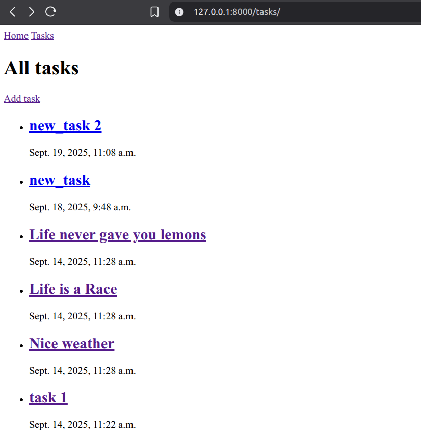

# Hello World of Web Development

I made a article series on `REACT JS`. Which went (life is pain but no traction gained :/ ) nowhere. But I guess I'm back.

Becuase what is Frontend without a Backend. So This article series is on `Django` and this is the first project of the series.

It's a siple To-Do application built solely using `Django` and some `Bootstrap` for styling and I called it `Hello World of Web Development` because this is the first project of the series and everyone starts with a To-Do application.

- [LinkedIn](https://www.linkedin.com/in/pro-programmer/)
- [YouTube](http://www.youtube.com/@itvaya)
- [gtihub](https://github.com/RishatTalukder/learning_react)
- [Gmail](talukderrishat2@gmail.com)
- [discord](https://discord.gg/ZB495XggcF)

#### Pre-requisites

- Python installed in your system
- Basic knowledge of Python
- Basic knowledge of HTML and CSS
- Basic knowledge of Django (not mandatory but helpful)
- Basic knowledge of Command Line (Terminal)
- Basic knowledge of Databases and Table relationships (not mandatory but helpful)

# Setting up a django project

First we need to create a `virtual environment` to keep our project dependencies isolated from other projects. To do that, open your terminal and first check your version of python by running the command:

```bash
python --version # for windows
```

or

```bash
python3 --version # for mac and linux
```

I'm using python 3.11.8 so you should have at least python 3.8 or higher.

Why we need a virtual environment?

Because when we are using multiple packages in our project, we don't want to mess up with the global packages that are installed in our system. So we create a virtual environment for each project. So, that it is isolated and free from any conflicts.

Now, navigate to your desktop or any other folder of your choice where you want to create your project using the `cd` command. For example, if you want to create your project in the desktop, run the command:

```bash
cd Desktop
```

I always like to keep all my projects in my `desktop` So that it's easy to find them.

So, to create a virtual environment, run the command:

```bash
python -m venv env # for windows
```

or

```bash
python3 -m venv env # for mac and linux
```

> A environment is like a fresh/portable python installation. it works exactly like a normal python installation but it is isolated from the global python installation.

This will create a folder named `env` in your project directory. I'll assume you also navigated to your desktop before running the command. So, you should see a folder named `env` in your desktop.

Now, that we need to do to use this fresh python installation is to activate it. To do that, run the command:

```bash
.\env\Scripts\activate # for windows
```

or

```bash
source env/bin/activate # for mac and linux
```

If you see `(env)` in your terminal, that means your virtual environment is activated. Now, you can install any package in this environment without affecting the global packages.

And we are ready to start our django project.

Let's install `Django` in our virtual environment. To do that, run the command:

```bash
pip install django
```

> ALways remember to check if the virtual environment is activated before installing any package. If not, you might end up installing the package globally which is not what we want.

After running check for the version of django by running the command:

```bash
django-admin --version
```

You should see the version of django installed in your virtual environment. As of now, the latest version is `5.2.6`.

And we are ready to start.

Our setup is complete.

# Creating a Django Project

To create a django project, navigate to your project directory (if you are not already there, for me it's the desktop) and run the command:

```bash
django-admin startproject TodoApp
```

This will create a folder named `TodoApp` in your project directory. This is the root project folder.

In side the `TodoApp` folder, you will see another folder named `TodoApp` and a file named `manage.py`. The inner `TodoApp` folder is the actual project folder where all the settings and configurations are stored. The outer `TodoApp` folder is just a container for the project.

This can cause some issues sometimes. So, to avoid that and make a cleaner structure, I like to make a root project folder before hand and then create the django project inside that folder. So, let's do the cleaner way.

First make a new folder in your desktop named `DjangoToDoApp` and then copy the whole `env` folder inside the `DjangoToDoApp` folder. So, now your project structure should look like this:

```
Desktop(your project directory)
│
└───DjangoToDoApp(root project folder)
    │
    └───env(virtual environment)
```

Now navigate to the `DjangoToDoApp` folder using the command:

```bash
cd DjangoToDoApp
```

Now run the previous command to create the django project:

```bash
django-admin startproject BACKEND . # the dot at the end is important
```

> It's the same command as before but the dot at the end is important. It tells django to create the project in the current directory instead of creating a new folder.

So, Now you should see the `Backend` folder and the `manage.py` file inside the `DjangoToDoApp` folder. So, now your project structure should look like this:

```
Desktop(your project directory)
│
└───DjangoToDoApp(root project folder)
    │
    ├───env(virtual environment)
    │
    ├───BACKEND(django project folder)
    │   │
    │   ├───__init__.py
    │   ├───asgi.py
    │   ├───settings.py
    │   ├───urls.py
    │   └───wsgi.py
    │
    └───manage.py
```

Now, don't get confused with the names. Just think of `DjangoToDoApp` as the root project folder, `env` as the virtual environment, `Backend` as the django project folder and `manage.py` as the `main` file of the project.

Now, let's just Learn a bit about the files and folders that are created by default in a django project.

- `manage.py`: This is the main file of the project. It is used to run various commands like starting the development server, creating migrations, etc.
- `__init__.py`: This is an empty file that tells python that this folder is a package. We won't be needing to modify this file 99.9999% of the time.
- `asgi.py`: This is the entry point for ASGI-compatible web servers to serve your project. ASGI is the successor to WSGI and is used for handling asynchronous web applications. We won't be needing to modify this file 99.9999% of the time.
- `settings.py`: This is the main configuration file of the project. It contains all the settings and configurations of the project. We will be modifying this file `A LOT!`
- `urls.py`: This file contains all the URL patterns of the project. We will be modifying this file `A LOT!`. Maybe we will get more confused with this file than the `settings.py` file.
- `wsgi.py`: This is the entry point for WSGI-compatible web servers to serve your project. WSGI is the standard for Python web applications and is used for handling synchronous web applications. We won't be needing to modify this file 99.9999% of the time.

Now, that we have a basic understanding of the files and folders, let's run the development server to see if everything is working fine.

To do that, run the command:

```bash
python manage.py runserver # for windows, mac and linux
```

if this not working for linux or mac, try:

```bash
python3 manage.py runserver # for mac and linux
```

after running the command, you should see something like this:

```bash
Watching for file changes with StatReloader
Performing system checks...

System check identified no issues (0 silenced).

You have 18 unapplied migration(s). Your project may not work properly until you apply the migrations for app(s): admin, auth, contenttypes, sessions.
Run 'python manage.py migrate' to apply them.
September 14, 2025 - 06:55:27
Django version 5.2.6, using settings 'BACKEND.settings'
Starting development server at http://127.0.0.1:8000/
Quit the server with CONTROL-C.

WARNING: This is a development server. Do not use it in a production setting. Use a production WSGI or ASGI server instead.
For more information on production servers see: https://docs.djangoproject.com/en/5.2/howto/deployment/
```

If you see this, that means everything is working fine. Now, open your browser and go to the development server address given in the terminal. In my case, it's `http://127.0.0.1:8000/`. You should see the default django welcome page.


If you see this, that means everything is working fine. And we are ready to make a To-Do application using django.

## Understanding the structure of a fullstack web application

Now, django has a lot of built-in features and those can get really overwhelming really fast for a beginner.

So, let's learn the structure of every fullstack web application first.

A fullstack web application has two main parts:

1. Frontend
2. Backend

The frontend is the part that the user interacts with. It is responsible for displaying the data to the user and taking input from the user. The frontend is built using HTML, CSS and JavaScript.

The backend is the part that handles the logic and data of the application. It is responsible for processing the data and sending it to the frontend. The backend is built using a server-side programming language like Python, Ruby, PHP, etc. In our case, we are using `Django` which is a web framework built using `Python`.

Backend has two main parts:

1. Server
2. Database

The server is responsible for handling the requests from the frontend and sending the appropriate response back to the frontend. In this case `Django is the server`.

So, django should be able to handle the requests from the frontend and send the appropriate response back to the frontend. To send the appropriate response back to the frontend, django needs to know what data to send. This data is stored in a database.

So, there must be a way to connect the `database` with the `server`. This is done using an `ORM` (Object Relational Mapping) built in django. The `ORM` is responsible for converting the data from the database into a format that can be understood by the server and vice versa.


Django has it's own built-in `ORM` which is really powerful and easy to use and also it supports multiple databases like `SQLite`, `PostgreSQL`, `MySQL`, etc. Also it has it's own built-in `admin panel` which gives you a GUI to interact with the database. So, you don't need to write any SQL queries to interact with the database. You can just use the `ORM` to interact with the database.

So, for now let's stick to the default database which is `SQLite`. It is a lightweight database and it is perfect for small projects like this.

If you have the development server running, you should see some errors in the terminal. This is because we have some unapplied migrations. Migrations are like version control for your database schema. They are used to keep track of the changes made to the database schema over time.

But we don't have a database yet. So, let's create the database by applying the migrations. To do that, stop the development server by pressing `CTRL + C` in the terminal and then run the command:

```bash
python manage.py migrate
```

After that run the development server again by running the command:

```bash
python manage.py runserver
```

The errors should be gone now. If you see the default django welcome page again, that means everything is working fine.

And If you take a look in your project directory, you should see a new file named `db.sqlite3`. This is the database file. This file contains all the data of your application.

> if you are using vs code, you can see the database file in the file explorer. But not whats inside the file. I use a extension named `SQLite` to view the database file.

And we have a working django project with a database setup. Now, we are ready to make a To-Do application using django.

# Creating a Django App

First we need to create a `Django App`. It's a Application template that contains all the files and folders needed to build a `specific feature` of the project.

A project can have multiple apps. For example, a blog project can have a `blog` app, a `comments` app, a `users` app, etc. Each app is responsible for a specific feature of the project.

We can make multiple apps in a django project to keep the code organized and modular. But for this project, we will only make one app named `todo`.

To create a django app, make sure you are in the project directory (for me it's `DjangoToDoApp`) and run the command:

```bash
python manage.py startapp todo
```

> By running this command, a new folder named `todo` will be created in your project directory. This is the app folder.

So, now your project structure should look like this:

```
Desktop(your project directory)
│
└───DjangoToDoApp(root project folder)
    │
    ├───env(virtual environment)
    │
    ├───BACKEND(django project folder)
    │   │
    │   ├───__init__.py
    │   ├───asgi.py
    │   ├───settings.py
    │   ├───urls.py
    │   └───wsgi.py
    │
    ├───manage.py
    │
    └───todo(django app folder)
        │
        ├───__init__.py
        ├───admin.py
        ├───apps.py
        ├───models.py
        ├───tests.py
        ├───views.py
        └───migrations
            └───__init__.py

```

In this folder, you will see some files and folders that are created by default. Let's learn about them:

- `__init__.py`: This is an empty file that tells python that this folder is a package. We won't be needing to modify this like never.
- `admin.py`: This file is used to register the models in the admin panel. We will be modifying this file later.
- `apps.py`: This file is used to configure the app. We won't be needing to modify this file like never.
- `models.py`: This file is used to define the models of the app. We will be modifying this file a lot.
- `tests.py`: This file is used to write tests for the app. We won't be needing to modify this file for now.
- `views.py`: This file is used to define the views of the app. We will be modifying this file a lot.
- `migrations`: This folder is used to store the migration files. We won't be modifying this folder at all.

Django uses the `MVC` (Model-View-Controller) architecture to build web applications. But in django, the `Controller` part is handled by the framework itself. So, we only need to worry about the `Model` and the `View` part.

## Model View Template (MVT) Architecture

This is a modern architecture used by a lot of web frameworks like `Django`, `Flask`, `Ruby on Rails`, etc. It is a variation of the `MVC` architecture.


Model refers to the `data` of the application. It is responsible for managing the data and the logic of the application. In django, the models are defined in the `models.py` file.

This is where we define the structure of the data and the relationships between the data. Which is handled by the `ORM` of django. ORMs are `Object Relational Mappers`. They are used to convert the data from the database into a format that can be understood by the server and vice versa and it is fully object oriented. So, we can interact with the database using python objects instead of writing raw SQL queries.

This model will send the data to the view when requested. View refers to the `user interface` of the application. It is responsible for displaying the data to the user and taking input from the user. In django, the views are defined in the `views.py` file. It takes handles the requests from the user and sends the appropriate response back to the user with the `Template`.

The template is the HTML file that is used to display the data to the user. It is responsible for rendering the data in a user-friendly way. In django, We will create a new folder named `templates` in the `todo` app folder to store the HTML files. but that's for later.

Also another thing that is left out is the `URL Dispatcher`. It is responsible for mapping the URLs to the views. In django, the URL dispatcher is defined in the `urls.py` file.

I hope you got a brief overview of the `MVT` architecture. We will be using this architecture to build our To-Do application.

Just remember, in a nutshell, the `Model` is responsible for managing the data which is used by the `View` to display the data to the user using the `Template` for a cirtain `URL` defined in the `URL Dispatcher`.

So, let's move on to the next step.

# Integreting the App with the Project

WHen we make a new app, we need to tell the engine(Backend) that we have a new app. So, that it can include the app in the project.

To do that, open the `settings.py` file in the `Backend` folder and then find the `INSTALLED_APPS` list. This list contains all the apps that are included in the project. By default, it contains some built-in apps like `admin`, `auth`, `contenttypes`, `sessions`, etc.

Add the name of the app that we just created to the top of the list. In our case, the name of the app is `todo`. So, add `'todo',` to the top of the list. It should look like this:

```python
# backend/settings.py
INSTALLED_APPS = [
    'todo',
    # 'todo.apps.TodoConfig',  # Optional: If you want to use the AppConfig class

    # Default Django apps
    'django.contrib.admin',
    'django.contrib.auth',
    'django.contrib.contenttypes',
    'django.contrib.sessions',
    'django.contrib.messages',
    'django.contrib.staticfiles',
]
```

You can also use the method documented in the [official documentation](https://docs.djangoproject.com/en/5.2/intro/tutorial02/) to add the app to the list. In the documentation, they use the `AppConfig` class to add the app to the list. But I prefer the first method because it is simpler and easier to understand. If it doesn't work, you can always try the second method.

You should see no errors in the terminal if you have the development server running. Now we can create our first model in the `models.py` file of the `todo` app.

> We will always try to follow this rule `model -> migrate -> view -> template` when we are building a feature. This will help us to keep the code organized, modular and less error prone.

# Making the first Model

Just give you guys an example of how to make a model in django i'll make a very simple model named `Task` in the `models.py` file of the `todo` app.

So, go to the `models.py` file and you should see something like this:

```python
from django.db import models
# Create your models here.
```

> This line imports the `models` module from the `django.db` package. This module contains all the classes and functions needed to define the models in django.

We will use this module to define our model.

Now, let's define the `Task` model. A task will have a `title` and date when it was created. So, we will define two fields in the model: `title` and `created_at`.

```python
from django.db import models

# Create your models here.

class Task(models.Model):
    title = models.CharField(max_length=200)
    created_at = models.DateTimeField(auto_now_add=True)

```

> Here, we defined a class named `Task` that inherits from the `models.Model` class. This class represents a table in the database. Each attribute of the class represents a column in the table.

- `title`: This is a `CharField` which is used to store string data. We have set the `max_length` attribute to `200` which means the maximum length of the title can be 200 characters.
- `created_at`: This is a `DateTimeField` which is used to store date and time data. We have set the `auto_now_add` attribute to `True` which means the field will be automatically set to the current date and time when the object is created.

Some more wise words about fields in django models:

> Class(inheriting models.Model) means a table in the database.
> Attributes inside the class means columns in the table.

So, Our database Should Look like this:

- Name of the table: `task` (appname_modelname in lowercase)
  | id | title | created_at |
  |----|-------------|---------------------|
  | 1 | Sample Task | 2023-09-14 10:00:00 |

Now, that we have defined our first model, remember the rule `model -> migrate -> view -> template`, we need to create a migration for the model and then apply the migration to create the table in the database.

So, by just making the model, we haven't created the table in the database yet. We need to create a migration for the model and then apply the migration to create the table in the database.

So, let's create a migration for the model. To do that, run the command:

```bash
python manage.py makemigrations
```

After running this command, you should see something like this:


this means the backend has detected the changes made to the models of the app and we have successfully created a migration for the model.

> If this doesn't work, make sure you have added the app to the `INSTALLED_APPS` list in the `settings.py` file. In my case, it worked by directly adding the app name to the list instead of using the `AppConfig` class. If it doesn't work for you, you might have to use the `AppConfig` class to add the app to the list like I have demonstrated before.

Now, to be sure if the migration is created successfully, you can check the `migrations` folder in the `todo` app. You should see a new file named something like `0001_initial.py`. This file contains the migration for the model.

```python
# Generated by Django 5.2.6 on 2025-09-14 10:27

from django.db import migrations, models


class Migration(migrations.Migration):

    initial = True

    dependencies = [
    ]

    operations = [
        migrations.CreateModel(
            name='Task',
            fields=[
                ('id', models.BigAutoField(auto_created=True, primary_key=True, serialize=False, verbose_name='ID')),
                ('title', models.CharField(max_length=200)),
                ('created_at', models.DateTimeField(auto_now_add=True)),
            ],
        ),
    ]
```

This is the migration file that is created for the `Task` model. What it does?

Open the `db.sqlite3` file using a SQLite viewer or any database management tool that supports SQLite. Trry to find the `task` table in the database. You wouldn't find it.

Django will use this file to create the table in the database when we apply the migration.

Now, we migrate.

```bash
python manage.py migrate
```

and you should see something like this:


This means the migration has been applied successfully and the table has been created in the database.

Now goto the database file and check if the table is created successfully. You should see a new table named `todo_task` in the database. This is the table that is created for the `Task` model.

Django automatically adds the app name as a prefix to the model name to create the table name to avoid any conflicts with other apps that might have the same model name.

And in the table, you should see three columns: `id`, `title` and `created_at`. The `id` column is automatically created by django as the primary key for the table.

I hope you understood all those steps. For me when I was learning django, this was sooo tough to understand. But now I can explain it in a simple way.

It's all about practice. The more you practice, the more you understand.

So, first rule: Model -> Migrate -> View -> Template

Second rule: Always `makemigrations` after any change in the models and then `migrate` to apply the changes to the database.

Now, let's talk about the `admin panel` of django.

# Django Admin Panel

Django has a nice built-in admin panel that allows you to manage the data of your application. It is a web-based interface that allows you to create, read, update and delete the data in the database.

Because we now have a table in the database, we need to add some data to be rendered on the screen. We can do that using the admin panel.

First we need to create a superuser to access the admin panel. To do that, run the command:

```bash
python manage.py createsuperuser
```

This will prompt you to enter a username, email and password for the superuser. Enter the details and press enter.

> Remember the username and password because we will need it to login to the admin panel.

Now, fo to the browser and go to the admin panel address which is `http://127.0.0.1:8000/admin/`. You should see the login page of the admin panel.

Enter the username and password that you just created and press enter. You should see the dashboard of the admin panel.


Now, you should see some options like `Users`, `Groups`, etc. These are the built-in models of django. But we don't see our `Task` model here because we haven't registered it yet.

We need to register the model in the `admin.py` file so that it can be accessed from the admin panel.

To do that, open the `admin.py` file in the `todo` app and you should see something like this:

```python
from django.contrib import admin

# Register your models here.
```

Here we can register our models. So, let's register the `Task` model. To do that, we need to import the model first. So, add the following line at the top of the file:

```python
from django.contrib import admin

# Register your models here.
from .models import Task

admin.site.register(Task)
```

Here, we imported the `Task` model from the `models.py` file and then registered it using the `admin.site.register()` method.

Now, reload the admin panel page in the browser. You should see a new option named `Tasks` in the dashboard.

You have full access to the `Task` model from the admin panel. You can create, read, update and delete the tasks from here.

> The admin panel is a powerful tool that allows you to manage the data of your application without writing any code. There are many more features in the admin panel that you can explore on your own.

Click on the `Tasks` option to go to the tasks page. You should see something like this:


The tasks page is empty because we haven't created any tasks yet. To create a new task, click on the `Add Task` button at the top right corner of the page.

You should see a form to create a new task. Enter the title of the task and click on the `Save` button at the bottom of the page.

You should see the task that you just created in the tasks page as `Task object (1)`. When you click it you should see the details of the task that you just created.

Which is great. We have successfully created our first model, made a migration for the model but one thing that I don't like is the naming of the task object. It should show the title of the task instead of `Task object (1)`, right?

This is because we haven't defined the `__str__` method in the model. This method is used to define the string representation of the object. By default, it returns the name of the class and the primary key of the object.

But we can override this method to return the title of the task instead. To do that, open the `models.py` file in the `todo` app and add the following method to the `Task` class:

```python
from django.db import models

# Create your models here.

class Task(models.Model):
    title = models.CharField(max_length=200)
    created_at = models.DateTimeField(auto_now_add=True)

    def __str__(self):
        return self.title # Override the __str__ method to return the title of the task
```

This will override the default `__str__` method and return the title of the task instead.

> These are called magic methods in python. They are used to define the behavior of the object. `__str__` is used to define the string representation of the object. And you must return something from this method. If you don't return anything, it will return `None` by default.

So, remember rule number 2?

Always `makemigrations` after any change in the models and then `migrate` to apply the changes to the database.

So, run the command:

```bash
python manage.py makemigrations
python manage.py migrate
```

Now, run the server again and go to the admin panel. You should see the title of the task instead of `Task object (1)`.

Noice.

Now, you can create more tasks from the admin panel and see them in the tasks page.

One cool thing about this is, if you take a look in the database file, you should see the tasks that you just created in the `todo_task` table.

Well, That's it for this part. We can now create, read, update and delete tasks (CRUD operations) from the admin panel. But we want to do it from the frontend, right?

Not So fast. Let's just finish up the backend part first.

Now, that we have a task title model. We should also store more information about the task right? Like it's `description`, `status` (completed or not), `priority` (high, medium, low), etc.

So, let's make a new table in the database to store this information.

# Making Detailed Task Model

To do that, we will create a new model named `TaskDetail` in the `models.py` file of the `todo` app. As this is a part of the `Task` model, we need to build a `relationship` between the two models.

If you don't know about relationships in databases, I suggest you to learn about it first. It is a very important concept in databases and you will be using it a lot when building web applications.

We will be using a `One-to-One` relationship between the `Task` and `TaskDetail` models. This means that each task can have only one task detail and each task detail can belong to only one task.

So, open the `models.py` file in the `todo` app and add the following code:

```python
class TaskDetail(models.Model):
    task = models.OneToOneField(Task, on_delete=models.CASCADE, related_name='details') # One-to-One relationship with Task model and when the task is deleted, the task detail will also be deleted
    description = models.TextField() # TextField is used to store large text data
    created_at = models.DateTimeField(auto_now_add=True) # auto_now_add is used to set the field to the current date and time when the object is created
    priority = models.IntegerField(default=1,choices=[(1,'Low'),(2,'Medium'),(3,'High')]) # IntegerField is used to store integer data and choices is used to limit the choices for the field
    completed = models.BooleanField(default=False) # BooleanField is used to store boolean data

    def __str__(self):
        return f"Detail for {self.task.title}"
```

Here, we defined a new class named `TaskDetail` that inherits from the `models.Model` class. Which represents the `taskdetail` table in the database.

- `task`: This is a `OneToOneField` field which is used to create a one-to-one relationship between the `Task` and `TaskDetail` models. We have set the `on_delete` attribute to `models.CASCADE` which means that when the `Task` object is deleted, the `TaskDetail` object will also be deleted. We have also set the `related_name` attribute to `'details'` which means that we can access the task details from the task object using `task.details`. If we don't set this attribute, django will use the default name which is `taskdetail_set`.

> The `related_name` attribute is used to specify the name of the reverse relation from the related object back to this one. In this case, it allows us to access the task details from the task object using `task.details`. If we don't set this attribute, django will use the default name which is `taskdetail_set`.

- `description`: This is a `TextField` which is used to store large text data. We will use this field to store the description of the task.
- `created_at`: This is a `DateTimeField` which is used to store date and time data. We have set the `auto_now_add` attribute to `True` which means the field will be automatically set to the current date and time when the object is created.
- `priority`: This is an `IntegerField` which is used to store integer data. We have set the `default` attribute to `1` which means the default priority of the task will be `Low`. We have also set the `choices` attribute to a list of tuples which limits the choices for the field. The first element of the tuple is the value that will be stored in the database and the second element is the human-readable name of the choice.
- `completed`: This is a `BooleanField` which is used to store boolean data. We have set the `default` attribute to `False` which means the task is not completed by default.
- `__str__` method: This method is used to define the string representation of the object. We have overridden this method to return the title of the task along with the text "Detail for".

Now, remember the rule?

Always `makemigrations` after any change in the models and then `migrate` to apply the changes to the database.

```bash
python manage.py makemigrations
python manage.py migrate
```

Now, run the server again.

Everything should be working properly. No errors in the terminal. Ignor the warnings.

Now, just like we registered the `Task` model in the `admin.py` file, we need to register the `TaskDetail` model as well.

To do that, open the `admin.py` file in the `todo` app and add the following line:

```python
from .models import Task, TaskDetail

admin.site.register(Task)
admin.site.register(TaskDetail)
```

Now, you should be able to see the `Task` model in the admin panel.

Now, we have two tables in the database: `todo_task` and `todo_taskdetail`. Add some data to the `todo_taskdetail` table and you should see it in the `todo_task` table.


> To add data you should see the some thing like this with an extra option for tasks. It's a drop down menu that has all the tasks in the database. You can select a task and then add data to it which will be stored in the `todo_taskdetail` table.

Now, that we have a working django project with a database setup. We are ready to make a To-Do application using django.

# Creating a View

Remember the rule `model -> migrate -> view -> template` when we are building a feature.

> Ps: This rule will change soon.

We made the models and the migrations. Now time to make a view.

A `view` is a function that takes some `input` and returns some `output`.

In django, a `view` is a function that takes a `request` object as input and returns a `response` object as output.

This view function will be responsible for handling the requests from the frontend and sending the appropriate response back to the frontend.

In short it takes a request finds the data from the database and sends it back to the frontend.

So, let's make a view function in the `views.py` file of the `todo` app.

Open the `views.py` file in the `todo` app and you should see something like this:

```python
from django.shortcuts import render
from django.http import HttpResponse
from .models import Task
from django.core import serializers
# Create your views here.


def index(request):
    data = Task.objects.all()
    data = serializers.serialize('json', data)
    return HttpResponse(data, content_type='application/json')
```

> This view function is taking a request as input and returning a JSON response as output.

> We have to use the `serializers.serialize()` method to convert the data we get from the database to a JSON string before sending it back to the frontend.

> HttpResponse is a class that will automatically set the correct headers and status code for the response.

> This should create a JSON response with the data from the database.

So, now let's See how we can show this data in the frontend.

We have everything ready and now we have to tell django where to put this view function in the browser.

If you take a close look at the `urls.py` file in the `BACKEND` app, you will see something like this:

```python
"""
URL configuration for BACKEND project.

The `urlpatterns` list routes URLs to views. For more information please see:
    https://docs.djangoproject.com/en/5.2/topics/http/urls/
Examples:
Function views
    1. Add an import:  from my_app import views
    2. Add a URL to urlpatterns:  path('', views.home, name='home')
Class-based views
    1. Add an import:  from other_app.views import Home
    2. Add a URL to urlpatterns:  path('', Home.as_view(), name='home')
Including another URLconf
    1. Import the include() function: from django.urls import include, path
    2. Add a URL to urlpatterns:  path('blog/', include('blog.urls'))
"""
from django.contrib import admin
from django.urls import path

urlpatterns = [
    path('admin/', admin.site.urls),
]
```

> The comments in the `urls.py` file has some valuable information about how we should use the `path()` function to map the URLs to the views.

This is the file where all our URLs should be defined. We will be using this file to map the URLs to the views.

AAANDDD that will change the rule to `model -> migrate -> view -> URL -> template`.

Now, let's add the path for our view function in the `urls.py` file.

Open the `urls.py` file, I'll remove the comments and add the following code:

```python
from django.contrib import admin
from django.urls import path
from todo.views import index #we have to import the view function here
urlpatterns = [
    path('admin/', admin.site.urls),
    path('', index, name='index'), #we have to add the path for the view function here
]
```

> Here right after the `from django.urls import path` line, we have to import the view function from the `todo.views` module. Because we are going to connect the view function to the URL.

After that, we can create a new path for the view function. Byt adding the `path()` function and passing the URL as the first argument and the view function as the second argument.

> The `name` argument is optional and it is used to give a name to the URL. It can be helpful sometimes.

Here we are adding this view function to the root URL of the application.

So, if we run the server again, we should see something like this:


And we can see the data and it's format in the root URL of the application.

GREAT! We have a working django project with a database setup.

WE HAVE DONE ALL THE STEPS.

And I hope you understood all those steps well. I know it's a long process but once you get the hang of it, it's really easy.

> PS: THE HARD PART IS STILL ON IT'S WAY.

We this was the very basic building blocks of a django project.

But if we continue this path we will face some very painful problems.

So, Time to make the code a little neat and tidy.

# Making the code a little neat and tidy

First, let's follow the real advice given by the Django documentation.

NEVER, EVER, EVER, EVER, EVER, EVER use directly make `paths` of different apps in the `BACKEND/urls.py` file.

This is because it will cause a lot of problemsm confusion and conflicts.

So, we should always make a new file inside the app folder and Where we will create all the paths for all the views of the app and we can connect them to the URLs.

For example, if we want to create a path for the `index` view of the `todo` app, we should create a new file named `urls.py` inside the `todo` app folder and add the following code:

```python
from django.urls import path
from .views import index

urlpatterns = [
    path('', index, name='index'),
]
```

It should be `EXACTLY` as above. If there is even a single difference, it will not work.

> This the issue I will always have with Django. Sometime the typos will cause the whole project to break.

So, be careful...

> Advice: Just copy the code from the `BACKEND/urls.py` file and paste it in the new file and remove the admin panel path.

Now, let's connect the new path to the URL.

Open the `BACKEND/urls.py` file and add the following code:

```python
from django.contrib import admin
from django.urls import path, include # We have to import the include function here

urlpatterns = [
    path('admin/', admin.site.urls),
    path('', include('todo.urls')),
]
```

Here, we have used the `include()` function to include the `urls.py` file of the `todo` app.

This will attach all the paths of the `todo` app to the root URL of the application.

You can do some experimentation by changing the path for the include function to include the `urls.py` file of any other app you have created.

Let's say we want to include the `todo` app path to the `/tasks` URL.

```python
from django.contrib import admin
from django.urls import path, include # We have to import the include function here

urlpatterns = [
    path('admin/', admin.site.urls),
    path('tasks/', include('todo.urls')),
]
```

Now the root URL of the application should show some error like this:


This is because we changed that path to render the url of the `todo` app from the root URL(`''`) to `/tasks`.

So, if we go to the `/tasks` URL, we should see the data and it's format in the root URL of the application.

It's best practice to set different URLs for different Apps.


Now, time to make a real Front Page.

# Making a Real Front Page with Django

We know the steps and now we can make an actual Front Page with Django.

We have evrything ready and do you remember the rule `model -> migrate -> view -> URL -> template`?

Let's setup a template in the `todo` app.

Open the `templates` folder in the `todo` app and create a new folder named `todo`. And inside that folder, create a new file named `index.html`.

YES! YOU OPEN A NEW FOLDER NAMED `templates` IN THE `todo` APP AND CREATE ANOTHER FOLDER NAMED ACCORDING TO THE APP NAME(IT HAS TO BE THE SAME AS THE APP NAME) AND INSIDE THAT FOLDER, CREATE A NEW FILE NAMED `index.html`.

> NOTE: `todo/templates/todo/index.html`

I'll tell you why we need this whacky naming convention.

JUST DO IT!

Now, let's make a template for the `index` view of the `todo` app.

Open the `index.html` file in the `todo` app and you should see something like this:

```html
<!-- todo/templates/todo/index.html -->
<h1>WELCOME!</h1>

<h2>This is the Home page of the To-Do application</h2>
```

This is the default template that is used by the `index` view of the `todo` app.

> This is the default template that is used by the `index` view of the `todo` app.

Now, we connect this template with the `index` view of the `todo` app.

> I'll comment out the previous index function and add the following code:

```python
from django.shortcuts import render
from django.http import HttpResponse
from .models import Task
from django.core import serializers
# Create your views here.


# def index(request):
#     data = Task.objects.all()
#     data = serializers.serialize('json', data)
#     return HttpResponse(data, content_type='application/json')

def index(request):
    return render(request, 'todo/index.html')
```

> This is the `index` view of the `todo` app. We have added the `render()` function to render the template named `todo/index.html`.

The render function takes two arguments, the first is the request object and the second is the template name.


Now, let's run the server again and go to the root URL of the application.


And we can see the data and it's format in the root URL of the application.

Awesome!

Now let's talk about the `weird` naming convention.

## Template Naming Convention

Django projects usually have a lot of apps. And these apps has their own templates and views.

So, it can be a hassle to keep track of all the templates and views of all the apps. So, what django does is search for the template and view in the `templates` folder of the app and if it doesn't find it, it will search in the `templates` folder of the root project.

Now, this can cause some conflicts.

Let's say you have an app named `blog` and you have a template named `index.html` in the `blog` app.

And you have another app named `todo` and you have a template named `index.html` in the `todo` app.

If you run the server, you will see the `index.html` template of the `blog` app and not the `index.html` template of the `todo` app.

This is because django will search for the template in the `templates` folder of the `blog` app first and if it doesn't find it, it will search in the `templates` folder of the root project.

Why it'll search in the blog app first?

It's because we added the app to the `INSTALLED_APPS` list in the `settings.py` file of the root project.

Whatever app comes first in the `INSTALLED_APPS` list will be the first app that django will search for the template in then the next app and so on.

So, if we have multiple apps in the `INSTALLED_APPS` list and each app has a template with the same name, django will search for the template in the app that comes first in the `INSTALLED_APPS` list first.

This is the reason why we have to follow the `weird` naming convention. Which will specify the app name in the template name.

This way we can avoid any conflicts and make our code a little neat and tidy.

Now, another issue will arise.

## Template Inheritance

As you can see we can directly add html code in a template and connect a view to it. It will render the html code in the template.

But think about a normal html page. It has a lot of common code like the header, footer, navigation, etc.

These elements don't change often and they are common for all the pages.

So, how can we make a template that can be reused for other templates?

This is called `template inheritance`.

Template inheritance is a way to reuse a template and make it more generic.

For example, we can make a `base.html` template and all the other templates can inherit from it.

Here is the `base.html` template:

```html
<!DOCTYPE html>
<html lang="en">
<head>
    <meta charset="UTF-8">
    <meta name="viewport" content="width=device-width, initial-scale=1.0">
    <title>Document</title>
</head>
<body>
    <h1>This is the base template</h1>
    
    <!-- This is the content block where all the content will be added -->
    
</body>
</html>
```

> This is the `base.html` template. Which the structure of a standerd html page and Inside that we have a `content` block where all the content will be added.

Don't get worried about the `block` tags.

As we are using a non-standard framework, we have to write the code in a different language than `JS` in side a html file to work with it.

So, django has a built-in template language called `Jinja2` which is used to render the templates.

If you are using vs code you can install the [django extension](https://marketplace.visualstudio.com/items?itemName=batisteo.vscode-django) to get syntax highlighting for the django template language.

I refer to this as `django template tags` because they are used to render the templates.

There many types of `django template tags` and we will learn about them as we move forward with the project.

Now, let's talk about the `block` tags.

The `block` tags are used to define the content block where all the content will be added when the template is inherited.

For example, we can define a `content` block in the `base.html` template and all the other templates can inherit from it.

And when they inherit from the `base.html` template, they will be able to add their content to the `content` block.

Now, a common misconception is that the `block` tags are used to define only the `content` block or we should always use the `block content` tag to define the content block.

The syntax for the `block` tags is like this:

```html

    <!-- This is the content of the title block -->

```
> Here you can see the `block` tag and the `title` argument. We can put anything we want in the `title` argument and it will be used as the name of the content block.

So, we can define the `title` of the block to specify where in the base template the content of the block will be added.

Now, let's inherit this base template in our `index.html` template.

Open the `index.html` file in the `todo` app and let's extend:

```html


<h1>WELCOME!</h1>

<h2>This is the Home page of the To-Do application</h2>
```

> The extends tag is used to inherit the base template and we add the path of the base template in the `todo/base.html` file.

Now, let's run the server again and go to the root URL of the application.


Well this is interesting. The base is there but where is the index?

Well, it's because the index.html file is extending the `base.html` which makes the `index.html` a child template of the `base.html` template.

In the `base.html` template, we have a `content` block that specifies where the `content` of the child template will be added and now we have to tell django what to put in the `content` block of the `index.html` template.

So, we will add the block content tag in the `index.html` template.

```html



  <h1>WELCOME!</h1>

  <h2>This is the Home page of the To-Do application</h2>

```

Now, the contents of the `index.html` template will be added to the `content` block of the `base.html` template.


A little confusing right?

> Rule 3: Always add a block for the child template and with the same name as the block of the parent template.

One last thing I want to show you guys is how we can add links to different pages in the `base.html` template.

We can add links to different pages in the `base.html` template by using the `url` tag.

For example, we can add a link to the `index` page of the `todo` app by using the following code:

```html
<a href="">Home</a>
```

> The `url` tag is used to get the URL of the page and the `index` argument is the name of the view function of the `todo` app.

Remember we added a name attribute to the `index` view function in the `urls.py` file of the `todo` app.

```python
#todo/urls.py
from django.urls import path
from todo.views import index

urlpatterns = [
    path('', index, name='index'), #the name of the URL is index
]
```

> We use this name to get the URL of the `index` view function.

The url tag will automatically add the URL of the `index` view function to the `Home` link.

I hope you understood everything well.

Now let's see the data in the browser.

# Rendering the data in the browser

Let's talk about the `render()` function.

The `render()` function is used to render the template in the `index` view of the `todo` app.

When we are in a url the view function of that url is called and the `render()` function is used to render the template.

But it has some other uses too.

It can send a HTTP response to the browser with the data in the template.

> Simply: we can send data to the browser with the template along with the HTTP response.

So, let's see what tasks are in the database.

We will make a new page for it. And do you remember the rule `model -> migrate -> view -> URL -> template`?

We have the model for the tasks in the database. WE also migrated the database.

now we need a view function to render the template.

Let's make a new view function in the `todo` app.

Open the `views.py` file and let's make a new function named `tasks`.

```python
#todo/views.py
from django.shortcuts import render
from django.http import HttpResponse
from .models import Task
from django.core import serializers
# Create your views here.


#everything else stays the same

def tasks(request):
    data = Task.objects.all() #we have to get the data from the database
    context = {'tasks': data} #we have to add the data to the context
    return render(request, 'todo/tasks.html', context) #we pass the context to the render function
```

> This is the `tasks` view function of the `todo` app. We have added the `render()` function to render the template named `todo/tasks.html` and we have added the data to the context.

The data will be available via the `tasks` key in the context.

So, let's make a url for the `tasks` view function.

Open the `urls.py` file and add the following code:

```python
#todo/urls.py
from django.urls import path
from todo.views import index, tasks

urlpatterns = [
    path('', index, name='index'), #the name of the URL is index
    path('tasks/', tasks, name='tasks'), #the name of the URL is topics
]
```

The url is set now time for the template.

Make a new file inside the `templates/todo` folder named `tasks.html`.

Open the `tasks.html` file and you should see something like this:

```html
<!-- todo/templates/todo/tasks.html -->



  <h1>
    This is the tasks page of the To-Do application
  </h1>

```
> Here we extend the `base.html` template and inside the `content` block we have a `h1` tag with the text `This is the tasks page of the To-Do application`.

This should render correctly in the `localhost:8000/tasks/` URL.


I've some changes to the `base.html` template. I removed the `h1` tag. I want to make the base template a navigation bar for the whole application.

Let's add the a new link for the `tasks` page in the `base.html` template.

```html
<!-- todo/templates/todo/base.html -->
<!DOCTYPE html>
<html lang="en">
<head>
    <meta charset="UTF-8">
    <meta name="viewport" content="width=device-width, initial-scale=1.0">
    <title>Document</title>
</head>
<body>
    <a href="">Home</a>
    <a href="">Tasks</a>
    
    <!-- This is the content block where all the content will be added -->
    
</body>
</html>
```

> The `url` tag is used to get the URL of the page and the `tasks` argument is the name of the view function of the `todo` app.

Now, how do we access the data we sent to the template?

We can access the data in the template by using the `context` variable.

For example, we can access the data in the `tasks` view function by using the `context` variable.

It's pretty simple. We can render the whole context in the template by using `{{}}` which is called a `template variable`.

Inside the double curly braces, we can access the keys of the context and the values of the context.

So, let's access the `tasks` key in the context and render it in the template.

```html
<!-- todo/templates/todo/tasks.html -->



  <h1>This is the tasks page of the To-Do application</h1>
  {{tasks}}

```

> Now if you reload the browser, you should see the whole data of the tasks in the database.


You can access a single key in the context by using the dot notation. Let's say I want only the `first` entry of the tasks to be rendered in the template.

I can do that by using the dot notation.

```html
<!-- todo/templates/todo/tasks.html -->



  <h1>This is the tasks page of the To-Do application</h1>
  {{tasks.0}}

```

> We cannot do indexing the python way but we can do it in the template using the dot notation.

And it will render the first entry of the tasks list.


We can also access other properties of the tasks object.

For example, we can access the `title` or `created_at` property of the tasks object by using the dot notation.

```html
<!-- todo/templates/todo/tasks.html -->



  <h1>This is the tasks page of the To-Do application</h1>
  {{ tasks.0.title }}
  {{ tasks.0.created_at }}


```


> Here I'm taking the `0` index of the tasks list and accessing the `title` and `created_at` property of the tasks object.

We can do a lot more that just rendering the data independently.

We can have for loops and if statements and other things.

So, let's list out all the tasks in the database.

Open the `tasks.html` file and add the following code:

```html
<!-- todo/templates/todo/tasks.html -->



  <h1>This is the tasks page of the To-Do application</h1>

  
    <h2>{{ task.title }}</h2>
    <p>{{ task.created_at }}</p>
  



```

> Here we have a for loop that loops through all the tasks in the database and renders the title and created_at of each task.

Most of the django template tags have a starting `` and an ending `` tag.

For example, the `for` tag has a starting `` and an ending `` tag.


Not only that, we can use the `if` tag to check if a condition is true or false or `empty` to check if a list is empty.

Let's clean up the `tasks.html` file.

```html
<!-- todo/templates/todo/tasks.html -->



  <h1>This is the tasks page of the To-Do application</h1>

  <ul>
    
      <li>
        <h2>{{ task.title }}</h2>
        <p>{{ task.created_at }}</p>
      </li>
    
      <li>No tasks</li>
    
  </ul>



```

We can do so much more.

Like if you take a look at the `browser`, you can see the task are ordered by the date they were created in ascending order.


THis is because by default the data is sorted by the `created_at` field in ascending order.

Let's say we want to order the tasks by the `created_at` field in descending order.

WE can do that in two ways. 

1. We can Query the database to order the tasks by the `created_at` in descending order.

2. We can do it directly in the template.

Doing it in the template might be a little advanced for now. So, I'll just query the database to order the tasks by the `created_at` in descending order.

Open the `views.py` file and add the following code:

```python
def tasks(request):
    data = Task.objects.order_by('-created_at')
    context = {'tasks': data}
    return render(request, 'todo/tasks.html', context)
```

> Here we're using the `order_by` method to order the tasks by the `created_at` field in descending order.

The order by function takes a string as an argument which is the name of the field to order by. by default it is ascending order but we can use `-` to make it descending order.

Now if you take a look at the `browser`, you can see the tasks are ordered by the date they were created in descending order.


Lastly I want to talk about individual tasks.

# Setting Up Dynamic URLs

We have a list of tasks and we want to be able to access each task individually and do CRUD operations on them.

Manually creating individual URLs for each task is impossible.

So, we clearly need a way to dynamically create URLs for each task.

Just like `react routing`, `django` also has a way to dynamically create URLs for each task.

For example, if we have a task with the id of `1`, we can create a URL for it by using the `id` of the task.

so, In this case we need to create a view for each task.

> Remember the rule? `model -> migrate -> view -> URL -> template`

I want to make a page that will automatically render the template for each task and show the data of the task. Also The `task details`. That's why I made a one-to-one relationship between the `Task` model and the `TaskDetail` model.

So, in the view we will query the database for the task with the `id` that we will get from the URL then we will fetch the data from the `task` and `taskdetail` models and send it to the template.

Open the `views.py` file and let's do some coding:

```python
from django.shortcuts import render
from django.http import HttpResponse
from .models import Task, TaskDetail # import the Task and TaskDetail models
from django.core import serializers
# Create your views here.


# everything else stays the same

def single_task(request, id):
    task = Task.objects.get(id=id)
    taskdetail = TaskDetail.objects.get(task=task) # get the task details from the task
    # taskdetail = task.details # get the task details from the task directly
    context = {'task': task, 'taskdetail': taskdetail}
    return render(request, 'todo/single_task.html', context)

```

Now let's talk about whats happening in the `single_task` view function.

First, we need the id of the task from the URL. We will get it from the `id` parameter of the URL which will be passed to the `single_task` view function as an argument. So, that why I added the `id` parameter to the `single_task` view function.

Now, we need to query the database for the task with the id that we got from the URL.

We can use the `objects.get` method to query the database for the task with the id that we got from the URL.

After that we can fetch the data from the `task` and `taskdetail` models and send it to the template.

Now comes the dicey part.

How do we get the details:

- We can query the database for the task with that we got from the previous step.
    - We can use the `objects.get` method to query the database for the `TaskDetail` model.
    - As we have a one-to-one relationship between the `Task` and `TaskDetail` models, the query will automatically match the taskdetail to the task.

ORRRRR,

- We can use the `details` attribute of the `Task` model.
    - Remember we added a `related_name` attribute to the `task` field in the `TaskDetail` model. `task = models.OneToOneField(Task, on_delete=models.CASCADE, related_name='details')` check the `models.py` file.
    - We can use this name to directly get all the details of the task. So, we don't actually need to query the database from the `TaskDetail` model.
    - We can just use `task.details` to get all the details connected to the task.

- Then Just like the other views, we can render the template and send the data to the template.

Now, we can set a dynamic URL for each task.

```python
# todo/urls.py
from django.urls import path
from todo.views import index, tasks,single_task # import the single_task view

urlpatterns = [
    path('', index, name='index'), 
    path('tasks/', tasks, name='tasks'), 
    path('tasks/<int:id>', single_task, name='single_task'), # add the dynamic URL
]

```

> `<int:id>` is a placeholder for the id of the task. We are telling django that after `tasks/` we want to have the id of the task and we are setting a datatype for the id to be an integer.


Now, we can set up the template. If you go to the view, in the `single_task` view function, I named the template `single_task.html`. So, let's make a new file named `single_task.html` in the `todo/templates/todo` folder.

```html
<!-- todo/templates/todo/single_task.html -->

<!-- inherit from the base template -->
 



    <h1>Single Task</h1>
    <!-- display the title of the task -->
    <h2>{{ task.title }}</h2>
    <!-- display the created_at of the task -->
    <p>{{ task.created_at }}</p>
    <!-- display the description of the task -->
    <p>{{ taskdetail.description }}</p>
    <!-- display the priority of the task -->
    <p>{{ taskdetail.priority }}</p>
    <!-- display the completed status of the task -->
    <p>{{ taskdetail.completed }}</p>


```

> Here I'm rendering the title, created_at, description, priority, and completed status of the task.

Now, we can go to the `browser` and see the single task page.


I passed `http://127.0.0.1:8000/tasks/1` to the `browser` so that I can see the single task page of task id `1`. I can see the title, created_at, description, priority, and completed status of the task.

We are successfully displaying the details of the task in the template.

This means everythings working properly.

But this kinda shucks. Because we have to pass the url link directly to the browser.

Now, let's fix that.

We can turn the Titles on the `tasks` views into hyperlinks.

This way we can click on the title and go to the single task page.

Open the `tasks.html` template and add the following code:

```html
<!-- todo/templates/todo/tasks.html -->



  <h1>This is the tasks page of the To-Do application</h1>

  <ul>
    
      <li>
        <h2>
            <!-- adding the title into a link -->
          <a href="">
            {{ task.title }}
          </a>
        </h2>
        <p>{{ task.created_at }}</p>
      </li>
    
      <li>No tasks</li>
    
  </ul>

```
> Here you can see that I added an anchor tag `<a>` to the title of the task. And I added a link to the single task page.

> `` is django tag that will return the url of the single task page by taking the `name` of the url/view function and if it is a dynamic url, it will also take the value of the dynamic url which in this case is the id of the task.

> The `name` of the url/view function should be passed as a string to the `` tag.

Now if you did all that you can go to the `browser` and go to the tasks page at `http://127.0.0.1:8000/tasks/` and you should see something like this.

All the titles are blue links. You can click on them and go to the single task page.


Let's click on the last one. Which in this case is the oldest task.

> We ordered the tasks by the `created_at` field in descending order earlier. remember?

And success!

BUUUUUUUT!

There's still another problem left which can be pretty easily overlooked.

I only filled the details for the `first_task`.

So, If I click on any other task, what do you think would happen?!


This can be A big issue in the duture if we are not careful.

> We can fix this by adding a check to see if the details for this task exist or not.

Now, open the `single_task` view and add the following code:

```python
# todo/views.py
def single_task(request, id):
    task = Task.objects.get(id=id)
    try:
        taskdetail = TaskDetail.objects.get(task=task)
    except:
        taskdetail = None
    context = {'task': task, 'taskdetail': taskdetail}
    return render(request, 'todo/single_task.html', context)
```

> Here we are checking if an error is thrown when we try to get the details of the task. If the error is thrown, we will set the `taskdetail` to `None`. So, we can render the template and send the data to the template.

Now, let's go to the `browser` and see the single task page.


Now, if we go to any task that does not have details, we will see the Title of the task but no details.

We should make it more user friendly.

We can check if the `taskdetail` is `None` or not and if it's none, we can show a message to the user so, that they know they don't have any details for this task.

Open the `single_task.html` template and add the following code:

```html
<!-- todo/templates/todo/single_task.html -->



  <h1>Single Task</h1>
  <h2>{{ task.title }}</h2>
  <p>{{ task.created_at }}</p>

  <!-- check if the taskdetail is None -->
  
    <p>{{ taskdetail.description }}</p>
    <p>{{ taskdetail.priority }}</p>
  
    <p>No details Available</p>
  


```

> And after this small change, we can go to the `browser` and reload the browser.


NOICE!!!

We did it!

Now, we have error control and we have a better user experience.

Now, time for even more confusion.

# Adding a new task

Up until now, we have have made the database models, some pages to show the data and learned some django features.

But one of the crucial features of a web application is the ability to add new data to the database.

The user should be able add new tasks to the database.

How do we do that?

It's a complex process.

So, listen carefully.

There is a zero percent chance that you will understand this in the first attempt.

So, let's break it down.

We know that in a webpage for the user to send data to the server, we need to use a form that is a tag called `<form>`.

The form tag has a attribute called `method` which is used to specify the method(Get, Post) that is used to send the data to the server.

We have to use the form tag to send the data back to the server.

But when we get the data. How do we get it back?

Remember the rule? `model -> migrate -> view -> URL -> template`

For getting the data back, It's exactly the opposite.

So, `template -> URL -> view -> migrate -> model`

We get the data from the template, we send it to the view through the URL, the view processes the data and sends it to the model.

BUUUUUT, it's little more complicated.

As a full stack framework django has it's own way of handling a form.

The rule is still the same. But it's change a bit.

`Form -> View -> URL -> Template -> View -> Model`

> THIS WILL BE THE POST REQUEST RULE.

We can directly make a form in the template.

Get the data via the request object in the view and manually send it to the model.

Which is great! normal workflow, piece of cake.

But if you think about it this process is kinda repetitive. We make the form in the template with it's input fields and then we get the data from the request object, differentiate it and send it to the model and one issue will be `evaluation` of the data(if it's valid or not).

This is a redundent process which can be resolved using API's. But we are not in a django API project right now.

In django we can setup a form according to the models and our need before-hand and send it to the template using the context variable. And use that form for getting the data back from the template and all of this can be done without repetition.

> Django developers believes in DRY(Don't Repeat Yourself) principle. That's why they developed the django form.

So, let's first make a form.

Make a new file called `form.py` and add the following code:

```python
# todo/form.py
from django import forms

class TaskForm(forms.Form):
    task = forms.CharField(max_length=100) #charecter field for the task
    description = forms.CharField(widget=forms.Textarea) #text area for the description
    priority = forms.IntegerField(min_value=1, max_value=3, initial=1) #integer field for the priority
    completed = forms.BooleanField(required=False, initial=False) #boolean field for the completed

```

Read closely, we have a lot to unpack.

> In this file we are importing the `forms` module from the `django` library. This library has a lot of built in function and classes that can be translated to HTML.

> We are making a class called `TaskForm` which inherits from the `Form` class.

> In this class we set the `task`, `description`, `priority` and `completed` fields because a new task should have these fields.

> We set the task field to a `CharField` which is a text field that can have a maximum length of 100 characters.

> We set the description field to a `CharField` too. In general, a character field should have a limit but for description we don't want to limit it. That's why we use `widget=forms.Textarea` which is a text area field that can have unlimited characters. I'll talk about widgets later.

> We set the priority field to an `IntegerField`. This is the input field for the priority of the task which is a number between 1 and 3. We set this for the `taskdetail`, remember?

> We set the completed field to a `BooleanField`. This is the input field for the completed status of the task which is a boolean value.

> We set the default value for the priority field to 1.

> We set the minimum value for the priority field to 1.

> We set the maximum value for the priority field to 3.

> We are also setting up the completed field as optional, that's why we set `required=False` and the default value is `False`.

And we made a small form for taking input from the user.

This might look like I'm just doing things but I will turn this form into a template later without even writting a single line of input field in the template.

We have the form ready.

> POST REQUEST RULE: `Form -> View -> URL -> Template -> View -> Model`

Let's make a `view` for the form.

Open the `views.py` file and and we will just send this form to the template.

```python
# todo/views.py
from django.shortcuts import redirect, render
from django.http import HttpResponse
from .models import Task, TaskDetail
from django.core import serializers
from .form import TaskForm # import the form
# Create your views here.


# rest of the code stays the same

def AddTask(request): 
    form = TaskForm() # initialize the empty form
    context = {'form': form}
    return render(request, 'todo/add_task.html', context)

```

> Here I made a function called `AddTask` which return rendered `add_task.html` where it will send the form.

We also need the `URL` for the form.

Open the `urls.py` file and add the following code:

```python
# todo/urls.py
from django.urls import path
from todo.views import AddTask, index, tasks,single_task # import the views

urlpatterns = [
    path('', index, name='index'),
    path('tasks/', tasks, name='tasks'), 
    path('tasks/<int:id>', single_task, name='single_task'),
    path('tasks/new_task', AddTask, name='add_task'), #the name of the URL is add_task
]

```

> We added the `add_task` URL to the `urls.py` file and set the `path` to the `tasks/new_task`.

Now, let's make the template for the form.

Make a new file called `add_task.html` in the templates folder and add the following code:

```html
# todo/add_task.html



    <h1>Add a new task</h1>
    <form method="post">
      <!-- csrf token for security -->
         
        <!-- render the form as paragraphs -->
        {{ form.as_p }}
        <button type="submit">Save</button>
    </form>


```

We inherit form the `base.html` template then we add a the form tag where I set the method to `post` and inside the form tag I have a django csrf(will talk about this later) token tag that is for security. And then I render the form as paragraphs using the `as_p` method.

And like I said before, I'll not write a single line of input field in the template.

And here you have it just one line of django template code.

Now what do you think will happend if you go to the `browser` and go to the `add_task` page at `http://127.0.0.1:8000/tasks/new_task`?


And voila! You have a form to add a new task.

In the new_task page we see all the input fields rendered straight from the `form.py` class.

Shocked! right?

Django translates all the fields made in the `TaskForm` class into html input fields when we send the form to the template from the view as we did in the `views.py` file.

This reduces our code a lot.

And this class has a built in validation system for the form.

And a very intuitive way to use it.

Now, here we can see that the form is rendered in the template. And you should be able to write and edit inside the form.

So, now how do we send data from the form to the model?

Remember the `POST REQUEST RULE` my children?

`Form -> View -> URL -> Template -> View -> Model`

We have done 4 things so far.

Now, we to go back to the `views.py` file and check for the request method. 

When the use clicks the `Save` button in the form, the template will reload and send the data to the URL linked to the form. And it's will be a `POST` request.

So, as in that URL(`tasks/new_task`), wehave the view fuction rendering the `add_task.html` template. We can check for the request method in the `views.py` file and That's why we pass a request object by default to the view functions. The request object will have the form data stored and we can process it using the form class.

I think you will have a better understanding of this if I code a little bit more.

```python
# todo/views.py
from django.shortcuts import redirect, render
from django.http import HttpResponse
from .models import Task, TaskDetail
from django.core import serializers
from .form import TaskForm
# Create your views here.
# everything else stays the same


def AddTask(request):
    print(request)
    if request.method == 'POST': # if the request method is post
        form = TaskForm(request.POST) # passing the request to the form for processing
        if form.is_valid(): # if the form is valid
            title = form.cleaned_data['task'] # getting the title from the form
            description = form.cleaned_data['description'] # getting the description from the form
            priority = form.cleaned_data['priority'] # getting the priority from the form
            completed = form.cleaned_data['completed'] # getting the completed from the form
            task = Task(title=title) # creating a new task by passing the title as the title attribute of the Task model
            task.save() # we have to save the task to the database
            taskdetail = TaskDetail(task=task, description=description, priority=priority, completed=completed) # creating a new taskdetail by passing the task, description, priority and completed as the attributes of the TaskDetail model
            taskdetail.save() # we have to save the taskdetail to the database
            return redirect('tasks') # redirecting to the tasks page
    else:
        form = TaskForm() # if the request method is not post
    context = {'form': form}
    return render(request, 'todo/add_task.html', context)

```

Now, break it down step by step.

1. If the `request` method is `POST`, we create a `form` object by passing the `request.POST` to the `TaskForm` class.

    - `request.POST` is the data sent by the user in the form.

2. We can check if the `form` is valid by using the `form.is_valid()` method.

3. If the `form` is valid, we can get the data from the form by using the `form.cleaned_data` dictionary.

    - When we pass the `request.POST` to the `TaskForm` class, it will automatically validate the data and store it in a dictionary called `cleaned_data` where the field name is the key and the value is the data.

4. We can directly pass the data to the model class using the attribute name of the model class.

5. `Task` has only one attribute called `title` so we can directly pass the data to the `title` attribute of the `Task` model.

6. The `Task` model has a `save()` method to save the data to the database.

7. We do the same thing for the `TaskDetail` model and don't forget to save the data to the database.

8. After that we can redirect to the `tasks` page using the the `redirect()` function, passing the name of the `tasks` page as the argument.

9. ANNNND, if the `request` method is not `POST`, we create a new `form` object using the `TaskForm` class.

10. We pass the `form` object to the `add_task.html` template.

This way we can handle both type of requests in the same view function.

Now, Navigate to the new_task page(`/tasks/new_task`) and write some data in the form and click the `Save` button. You should be redirected to the `tasks` page and at the top of the page you should see the new task.

To be very sure you can also take a look inside the `db.sqlite3` file. You should see the new task in the `tasks` table and details for the new task in the `taskdetails` table.


And we are done!

Now we can add new tasks to the database.

And finally I'll add a button to the `tasks` page to add a `new_task`.

```html
<!--  todo/index.html -->



  <h1>All tasks</h1>
  <!-- Link to the add task page -->
  <a href="">Add task</a> 

  <ul>
    
      <li>
        <h2>
          <a href="">{{ task.title }}
          </a>
        </h2>
        <p>{{ task.created_at }}</p>
      </li>
    
      <li>No tasks</li>
    
  </ul>


```



And that's it!

Success!

We can click on the `Add task` button and add a new task to the database.

We have a lot of work to do. But if you've reached this far, you know the gist of how to use Django.

> And if you like the article this far, you can support me by leaving a star on the github repo/ leaving a like on this article. Also show your support by subscribing/following me on my socials. All the links are given at the start of the article.

Now, with that out of the way let's go full `CRUD` with the `Django` framework.

# CRUD (Create, Read, Update, Delete)

Now we know how to add new tasks(create data) for our application.

Let's add the Edit functionality.

Why am I doing this?

Because I want to torture myself.

Just kidding :) or am I?

No I'm just kidding? I have to.

This is because when a user adds new tasks, they have to add the details for the task.

The priority and the completed status is set automatically from the form and the user is forced to add the description for the task.

> If you try to keep the description empty, the form will not be valid and the user will not be able to save the task.

> Heres a task for you figure out how you can make the input field be optional or required.

So, if we add a new task, we need to add the details for the task and while adding or after addign we might want to change some of the details, like the descrition or the priority.

This is where the `Update` functionality comes in.

I will make a new page for a single_task where we can update the task and I'll add a button to the `single_task` page to update the task.

Let's edit the template.

```html
<!-- todo/single_task.html -->



  <h1>Single Task</h1>
  <h2>{{ task.title }}</h2>
  <p>{{ task.created_at }}</p>

  <!-- check if the taskdetail is None -->
  
  <!-- display the description -->
    <p>
      <strong>Description:</strong>
      {{ taskdetail.description }}
    </p> 
    <!-- display the priority -->
    <p>
      <strong>Priority:</strong>
      {{ taskdetail.priority }}
    </p>
    <!-- display the completed -->
    <p>
      <strong>Completed:</strong>
      {{ taskdetail.completed }}
    </p>
  
    <p>No details Available</p>
  
  <!-- Link to the edit task page -->
  <a href="">Edit Task</a>


```

I kept the `href` empty because I haven't added the edit task path and view function yet and also I've added some extra stuff to make the template look better.


Well now let's talk about the `UPDATE request`.

The update request is a `PUT` request.

- Create -> POST
- Read -> GET
- Update -> PUT
- Delete -> DELETE

Put request works exactly the same as the post request.

But instead of making a new task, it updates an existing task.

So, we would need a form to update the task.

SO, the rule is the same as the POST request.

> Form -> View -> URL -> Template -> View -> Model

Let's make a form.

```python
# todo/forms.py
from django import forms
from .models import TaskDetail

# TaskForm stays the same

class TaskDetailForm(forms.ModelForm):
    class Meta:
        model = TaskDetail
        fields = ['description', 'priority', 'completed']
```

Here you can see I'm using a different approach to make the form.

Previously I was using the `forms.Form` class to make the form. Now, I'm using the `forms.ModelForm` class to make the form.

What's the difference?

Almost everything is the same.

Let me explain step by step.

1. I'm using the `forms.ModelForm` class to make the form.
2. Inside the `TaskDetailForm` class, I have another class called `Meta`.
    - `Meta` class is for additional information about the form.
3. Inside the `Meta` class, we are telling django about the model and the fields we want to use.
4. `Form.ModelForm` will take the Meta information and make a form based on the model and the fields.
5. It'll know what type of fields will be set for the form based on the model and the fields given in the Meta class.

This shortens our code a lot but The issue is we can make a `Model form` for only one model in a class.

In the `TaskForm` class, I was making the form for different models but as I need to only make a form for the `TaskDetail` model, I'm using the `Model form` to make things easier.

Now, Let's make a view for the update task.

```python
# todo/views.py
from django.shortcuts import redirect, render
from django.http import HttpResponse
from .models import Task, TaskDetail
from .form import TaskDetailForm, TaskForm

# everything else stays the same

# Create your views here.
def UpdateTaskDetail(request, id):
    form = TaskDetailForm()
    context = {'form': form}
    return render(request, 'todo/update_taskdetail.html', context)
```
> We need the id of the task to get the task details from the database that's why I added the `id` parameter to the `UpdateTaskDetail` view function.

Here I'm sending the form to the template.

Let's set the path for the update task.

```python
from django.urls import path
from todo.views import AddTask, UpdateTaskDetail, index, tasks,single_task

urlpatterns = [
    path('', index, name='index'), 
    path('tasks/', tasks, name='tasks'), 
    path('tasks/<int:id>', single_task, name='single_task'),
    path('tasks/new_task', AddTask, name='add_task'),
    path('tasks/update_taskdetail/<int:id>', UpdateTaskDetail, name='update_taskdetail'), # the name of the URL is update_taskdetail
]

```

> Here I added the `update_taskdetail` URL to the `urls.py` file and set the `path` to the `tasks/update_taskdetail/<int:id>`.

Here I set the path to the `dynamic path` because I need to get the id of the task to get the task details from the database.

Now, let's make a template for the update task.

```html
<!-- todo/update_taskdetail.html -->



    <h1>Update Task Detail</h1>
    <form method="post">
        
        {{ form.as_p }}
        <button type="submit">Save</button>
    </form>


```

> Simply rendering the form to the template.

Here If you look closely, I'm using the `post` method even though I'm trying to update the task.

This is because Django treats the `post` method as the default method for updating and creating a new task.

Both works the same way and we can update the data using the view to the model.

If you look at the page you should see every field is empty and Not much information is there. I'm trying to edit the task details not fully recreate the task.

So, what I want is when I go inside this form to edit/update the task the form should be populated with existing data.

Let's make a view for the update task.

```python
# todo/views.py
from django.shortcuts import redirect, render
from django.http import HttpResponse
from .models import Task, TaskDetail
from .form import TaskDetailForm, TaskForm

# everything else stays the same

# Create your views here.
def UpdateTaskDetail(request, id):
    task = Task.objects.get(id=id) # get the task
    details = TaskDetail.objects.get(task=task) # get the task details
    form = TaskDetailForm(instance=details) # populate the form with the task details
    context = {'form': form, 'task': task}
    return render(request, 'todo/update_taskdetail.html', context)
```
> Here I'm getting the task and task details from the database and populating the form with the task details.

> By using the `instance` argument, the form will be populated with the values from the task details object automatically.

I also need to pass the task to the template so that I can display it in the template.

```html



<!-- display the title -->
    <h1>{{ task.title }}</h1> 
    <form method="ppost">
        
        {{ form.as_p }}
        <button type="submit">Save</button>
    </form>


```

Now, You should see the title of the task on top of the page and also the form to update the task details prepoulated with the existing data.


Now, let's update the task details.

```python
# todo/views.py
from django.shortcuts import redirect, render
from django.http import HttpResponse
from .models import Task, TaskDetail
from .form import TaskDetailForm, TaskForm

# everything else stays the same

# Create your views here.
def UpdateTaskDetail(request, id):
    task = Task.objects.get(id=id) # get the task
    details = TaskDetail.objects.get(task=task) # get the task details
    if request.method == 'POST':
        form = TaskDetailForm(request.POST, instance=details) # populate the form with the task details
        if form.is_valid():
            form.save()
            return redirect('single_task', id=id)
    else:
        form = TaskDetailForm(instance=details) # populate the form with the task details
    context = {'form': form, 'task': task}
    return render(request, 'todo/update_taskdetail.html', context)
```

> Here just like the `AddTask` view, I'm checking if the request method is `post` and if the form is valid then I'm saving the form and redirecting to the `tasks` page.

But there are some intricacies here.

First, The instance argument is very important here. `ModelForm` uses the `instance` argument to populate the form and also detect what we are trying to update.

By this instance argument, we are telling the form that we want to `UPDATE` this specific task details. Without this argument, the form will create a new task details object and save it to the database.

As we have a `one-to-one` relationship between the `Task` and `TaskDetail` models, we cannot add new task details to an existing task with `details`.

So, It would cause some very nasty errors.

So, we need to use the `instance` argument to populate the form with the existing task details and also update the task details That's why when after checking, to validate the form, I'm passing the `details` we got from the `request` to the form along with the `instance` argument.

Then with the `save()` method, we are saving the form and the data is updated in the database all internally.

> Note: ModelForm is a very useful feature of Django. It processess almost everything internally and makes things very easy to write but hard to understand. So, be very careful while using it and understand how it works.

Now, if we refresh the page, we should see a clean form and we can now update the task details.


Let's edit somethings.


Now, click on the `Save` button, It shoudl redirect you to the `single_task` page for this task and you should see everything updated.


And successfully updated the task details.